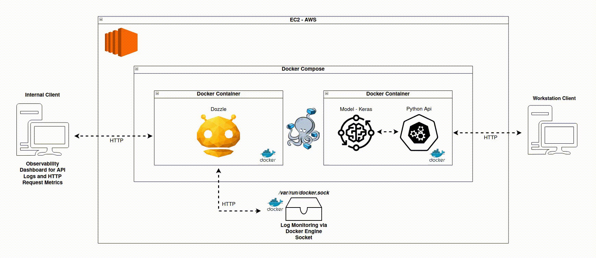
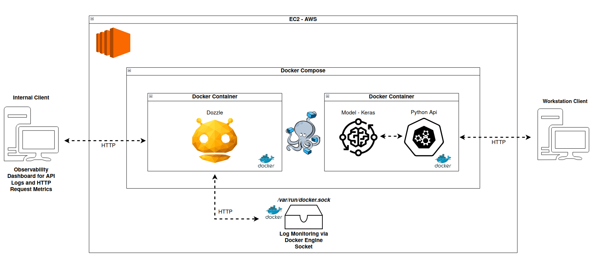

# 📈 LSTM Model API – Stock Price Prediction

This project implements an **LSTM (Long Short-Term Memory) model** for **stock closing price prediction**, exposing the trained model through a **RESTful API** built with **FastAPI**.  
The solution follows good **data science**, **machine learning**, and **MLOps** practices, including containerization with **Docker**.

---

## 🧠 Project Overview

The objective of this project is to:

- Train an LSTM model to predict the **next closing price** of a stock based on historical data
- Evaluate different model configurations and select the best-performing one
- Persist the trained model and preprocessing artifacts
- Expose predictions through a scalable and reusable **API**
- Make the solution reproducible using **Docker**

This project was developed as part of a **Machine Learning / Deep Learning technical challenge**, focusing on **time series forecasting**.

---

## 🗂️ Project Structure

```
lstm-model-api/
│
├── config/
│   ├── docker-compose-dev.yml
│   ├── docker-compose-prod.yml
│   └── docker-compose.dozzle.yml
│
├── scripts/
│   ├── down-dev.sh
│   ├── down-prod.sh
│   ├── run-dev.sh
│   └── run-prod.sh
│
├── app.py                     # FastAPI application
├── modelo_lstm.keras          # Trained LSTM model (Keras format)
├── scaler.pkl                 # MinMaxScaler used during training
│
├── tech_challenge_lstm.ipynb  # Notebook with data analysis, training and evaluation
│
├── Dockerfile                 # Docker image configuration
├── requirements.txt           # Python dependencies
├── README.md                  # Project documentation
│
├── .gitignore
└── .dockerignore
```

---

## 📊 Data Science & Modeling

### Model Type

- **LSTM (Long Short-Term Memory)**
- Suitable for sequential and time series data

### Input Data

- Historical **closing prices**
- Fixed sliding window (`window_size = 60`)

### Target

- **Next-day closing price**

### Preprocessing

- MinMax normalization using `MinMaxScaler`
- Sliding window sequence creation
- Same preprocessing pipeline reused in inference (API)

---

## 📉 Model Evaluation

Multiple configurations were tested, including:

- Different window sizes
- Increased model capacity
- Different loss functions (MSE vs MAE)

### Best Configuration Selected

- **Window size:** 90
- **Loss function:** MAE
- **Increased model capacity**

This configuration achieved the lowest error values (MAE, RMSE, and MAPE), indicating better generalization and robustness.

---

## 🚀 API Description

The API is built using **FastAPI** and exposes the trained LSTM model for inference.

### Available Endpoints

#### `POST /predict`

Predicts the **next closing price** based on the last 60 closing prices.

**Input**

```json
{
  "last_60_prices": [50.1, 50.2, "...", 51.3]
}
```

**Output**

```json
{
  "predicted_close_price": 51.68
}
```

---

#### `GET /health`

Health check endpoint to verify API and model availability.

---

#### `GET /model-info`

Returns metadata and configuration details about the trained model.

---

#### `POST /explain`

Provides a **simplified explanation** of the prediction based on recent trends and volatility.

---

## 🐳 Running with Docker

### Build the image

```bash
docker build -t model-lstm-api .
```

### Run with Docker Compose

```bash
docker-compose up
```

The API will be available at:

```
http://localhost:8000/docs
```

---

## 🧪 Interactive Documentation

FastAPI automatically generates interactive documentation using Swagger:

```
http://localhost:8000/docs
```

---

## 🛠️ Technologies Used

- Python 3.10+
- TensorFlow / Keras
- NumPy
- Scikit-learn
- FastAPI
- Uvicorn
- Docker & Docker Compose

---

## 📌 Key Highlights

- End-to-end ML pipeline (training → evaluation → deployment)
- Consistent preprocessing between training and inference
- REST API ready for integration
- Dockerized for reproducibility and deployment
- Clear separation between data science and production layers

---

## 🏗️ Architecture Diagram

### GIF

### 

### PNG

### 

## 📄 License

This project is for **educational and demonstrative purposes**.
